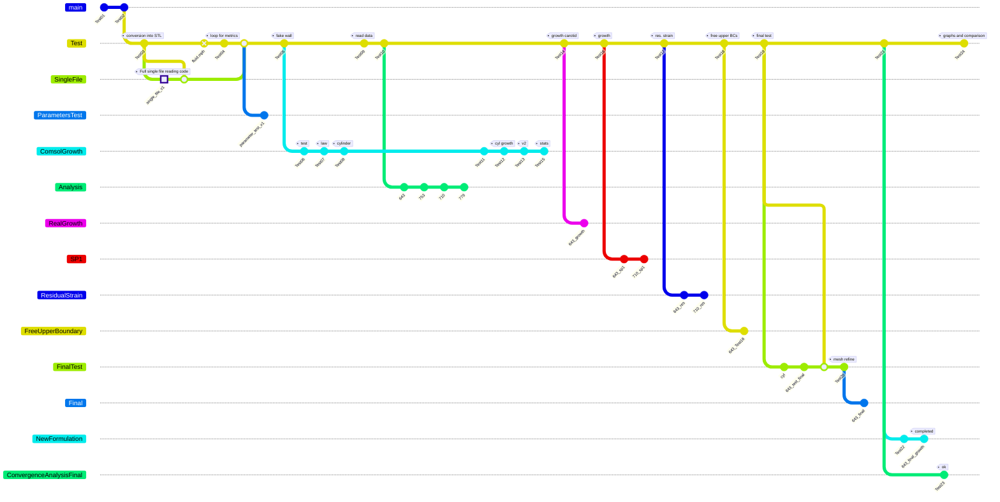

# The impact of residual strains on the stress analysis of atherosclerotic carotid vessels predictions based on the homogenous stress hypothesis
## Master Thesis
### Biomedical Engineering - University of Rome Tor Vergata

# Folders tree:

